#  Class0-课程环境的安装与下载

- *注意:相关的软件镜像请在课前下载到电脑,课上会带着安装,如果已经安装好环境的同学可以跳过这环节。

## 安装Texlive2022
** [安装教程参考博客一](https://blog.csdn.net/sunny0722/article/details/121220547)

** [安装教程参考博客二](https://zhuanlan.zhihu.com/p/494767232)

** [Texlive镜像下载]( https://mirrors.tuna.tsinghua.edu.cn/CTAN/systems/texlive/Images/)

- 1.下载Texlive软件的iso镜像到本地
  
  - 点击上方的Texlive镜像下载链接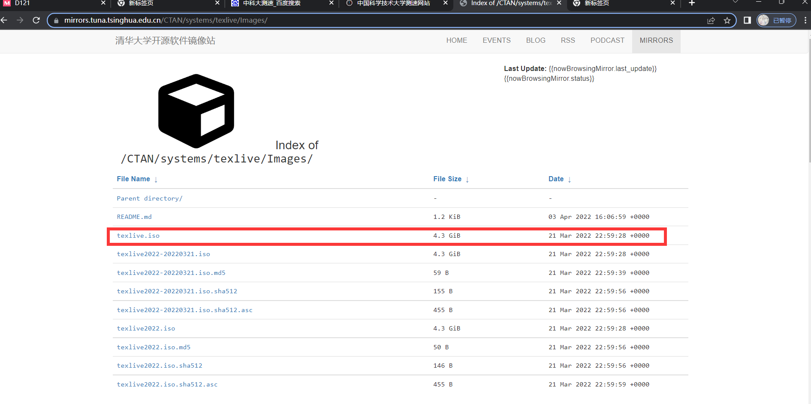
  - 双击图中的texlive.iso进行下载 
  
- 2.下载完成进行安装,双击挂在iso文件
  
  - 双击解压打开后可以看到有一个 install-tl-windows.bat文件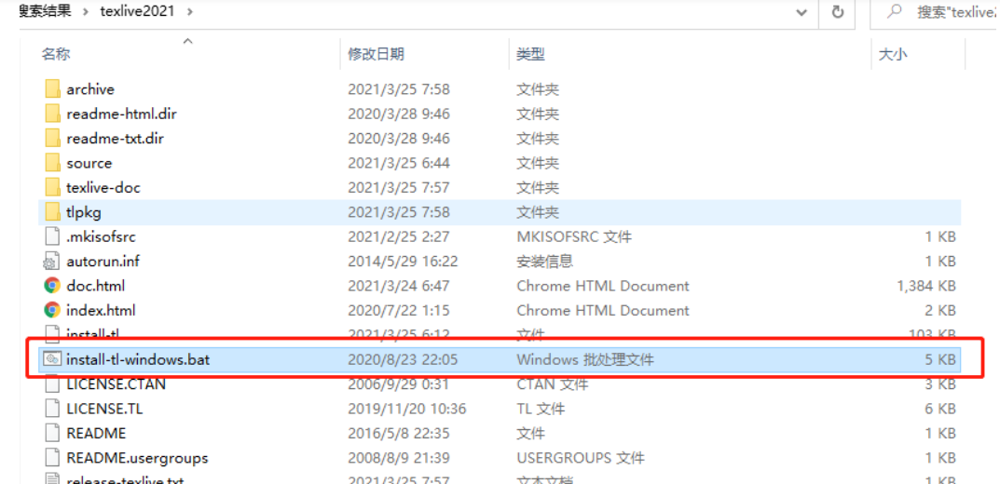

  - 右键,使用管理员权限打开
  
    - 由于texlive占用空间较大,默认安装目录是C盘,在安装时可以切换到其他硬盘
  
    - 如下图所示,双击打开程序后,点击Advanced，出现如下界面，用于配置安装选项,切换安装目录后,点击安装。
  
      ​	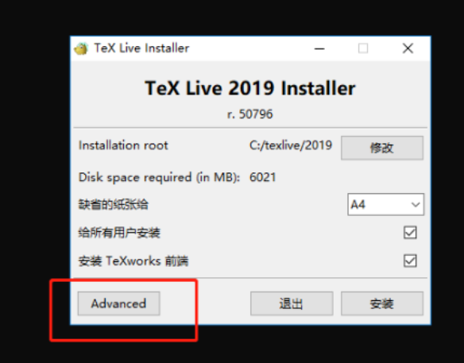
  
      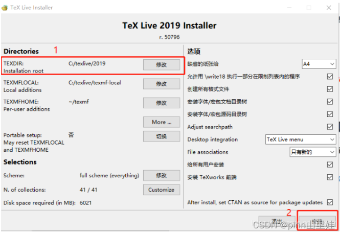
  
    - 完成安装后的页面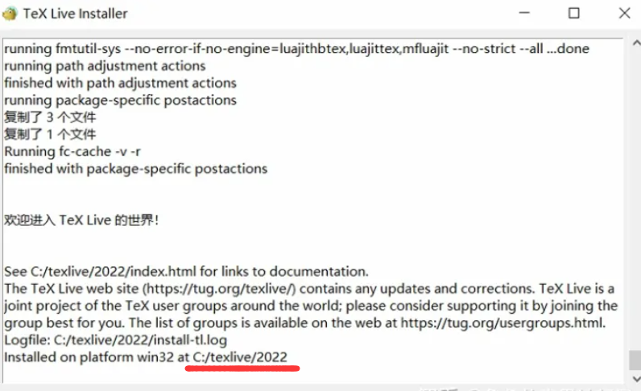
  
    - 等待程序运行，若出现上图所示的提示语,"欢迎来到TexLive世界",说明texlive安装完毕！
  
    **注意: 必须先安装texlive再安装TexStudio
  
    - 检查latex环境是否安装到电脑上
  
      - win+R快捷键打开程序搜索框 或者直接win11搜索 cmd命令行
  
        
  
        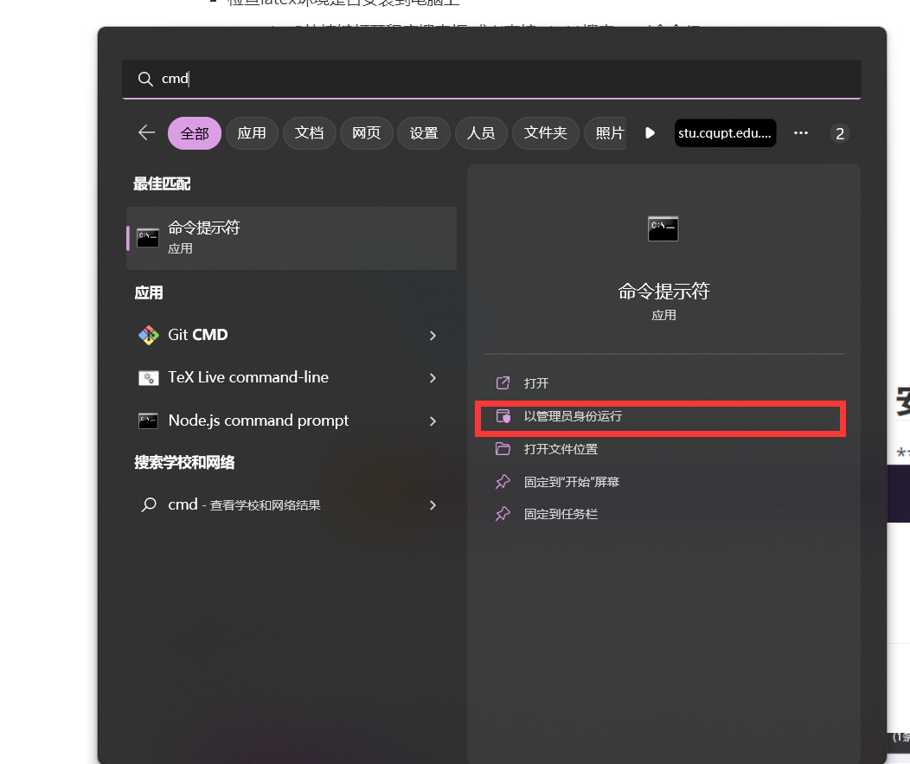
  
      - 打开命令行后输入tex,回车,若出现交互式操作界面如下图所示,说明安装成功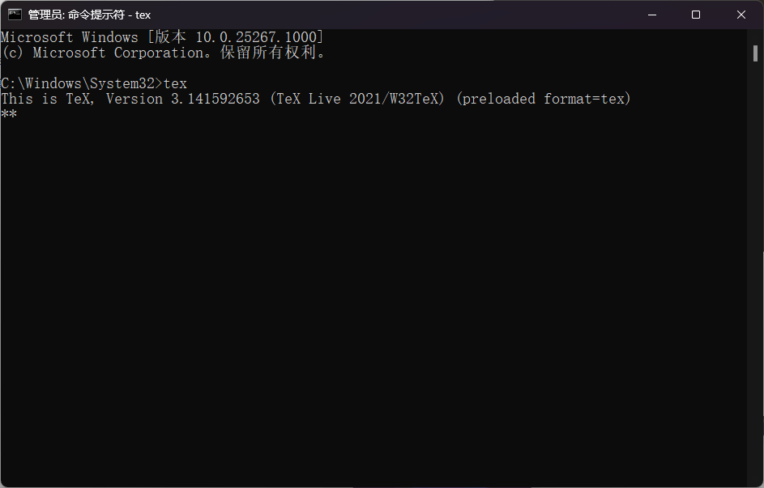
  
      - 同样的输入 latex -v 检查latex版本号 出现版本号说明安装正确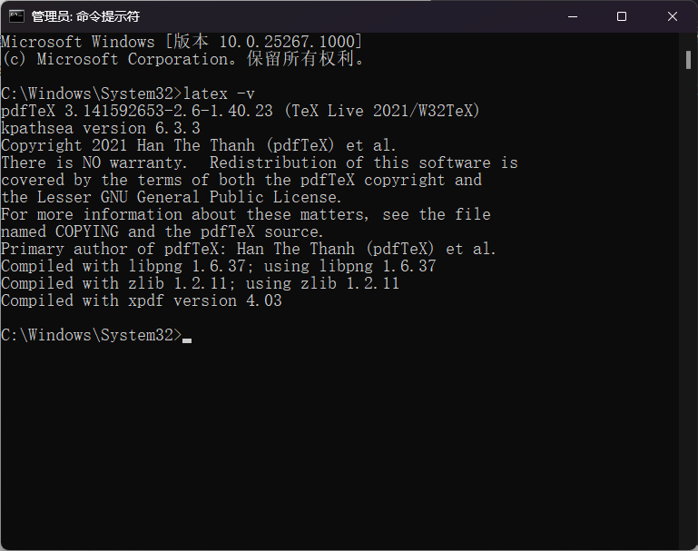
  
        
  
        -
## 安装TexStudio 4.0.0^

** [TexStudio下载](https://www.texstudio.org/)

 - TexStudio网站在境外,官方下载太慢的可以搭梯子

   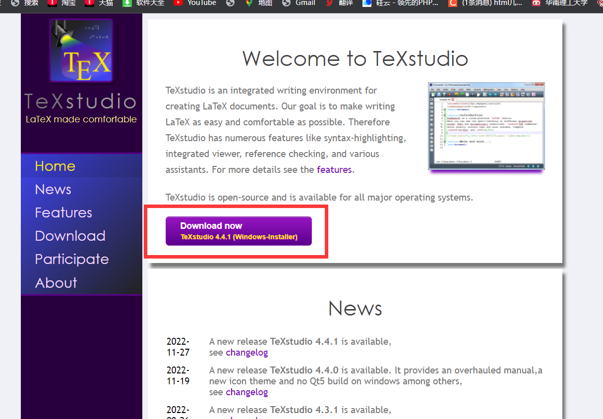

- 点击上图所示的按键下载安装包

- 下载完成双击安装TexStudio

  

## 克隆课件与论文模板

-** 可以在github上直接下载压缩包 但是比较慢 推荐先学习安装git 然后用git clone

## *拓展课：安装Typora并破解

- [Typora注册包下载](https://github.com/peitsan/Courseware-Tex-2023/tree/master/typro%E7%A0%B4%E8%A7%A3%E5%99%A8)
	- Typora安装包和注册机已经放在git仓库里了
	
- 双击压缩包解压到任意目录
	- 压缩包位置在这里
		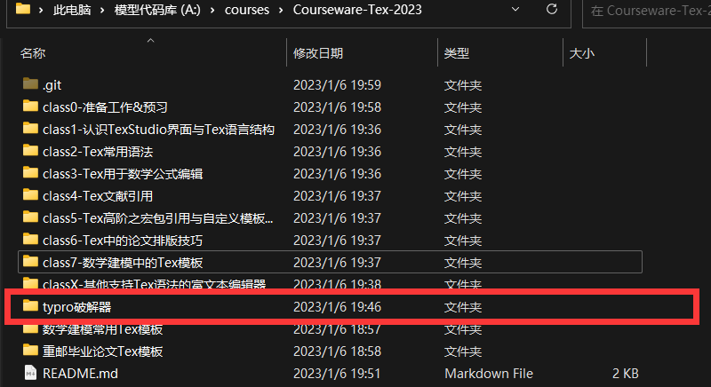-（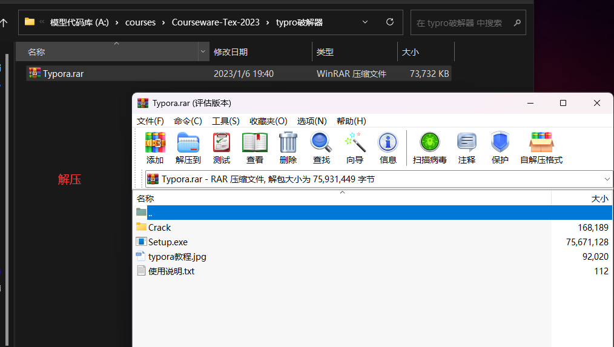
	- 打开压缩包解压后,双击软件安装包 setup.exe安装Typora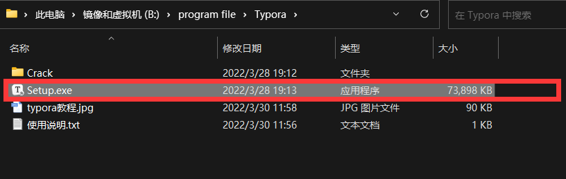
	- 双击打开后,按照知识一直Next,安装目录按照自己需求调整
	  
	  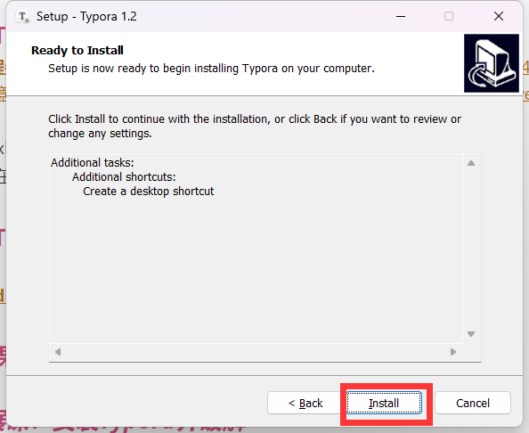
- 安装完成后需要破解typora, 打开压缩包解压出来的文件夹,找到Crack文件夹
	- 打开Crack文件夹并打开Typora安装目录
	- Crack文件下有一个app.asar文件 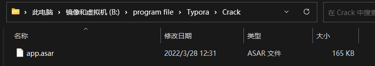
	- 安装目录的resource文件夹下也有一个app.asar文件
	- Typora安装目录
	- 用Crack文件夹里的app.asar替换掉resource下的app.asar
	- 替换即完成破解
	  
## *拓展课：安装git环境与github