# 认识TexStudio界面与Tex语言结构

## 	上手TexStudio

- **1.使用内置模板创建一个Tex工程**
  - 打开TexStudio软件 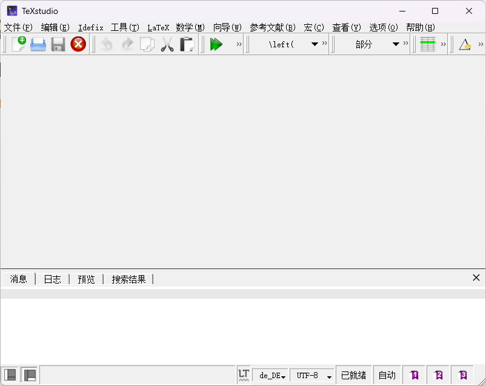
  - 在左上角依次找到点击 ”文件“-"从模板新建“,点击新建内置模板工程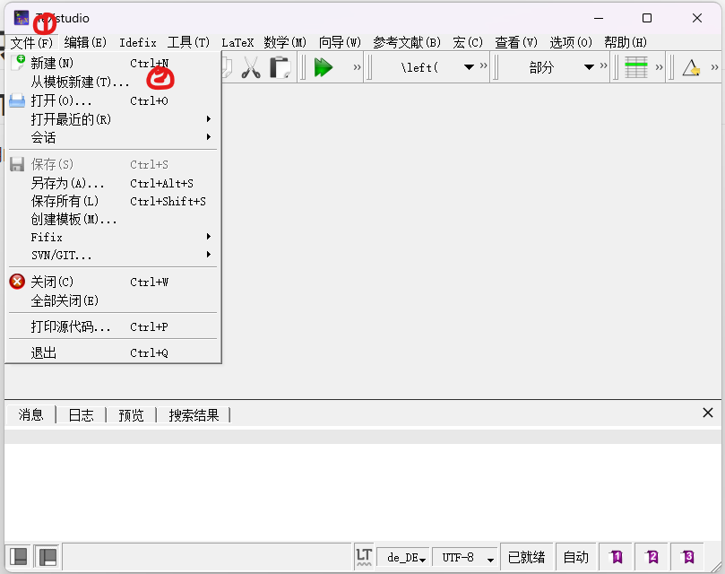
  - “选择一个内置模板”—>选中"在文件夹中创建"—>"将工程保存到自定义的目录下面"—>"OK"结束创建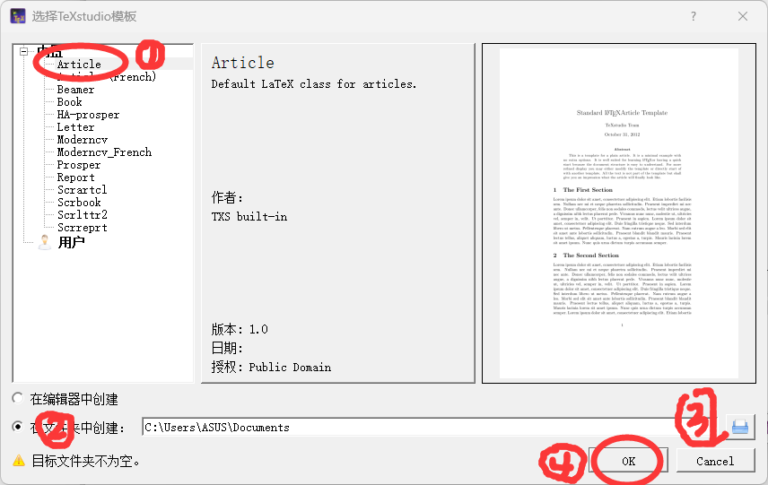

​				**建议修改文件目录统一到一个固定的位置 避免正式打比赛的时候找不到**

- **2.认识Tex软件界面**
  - 打开大纲视图（左下角第一个按键）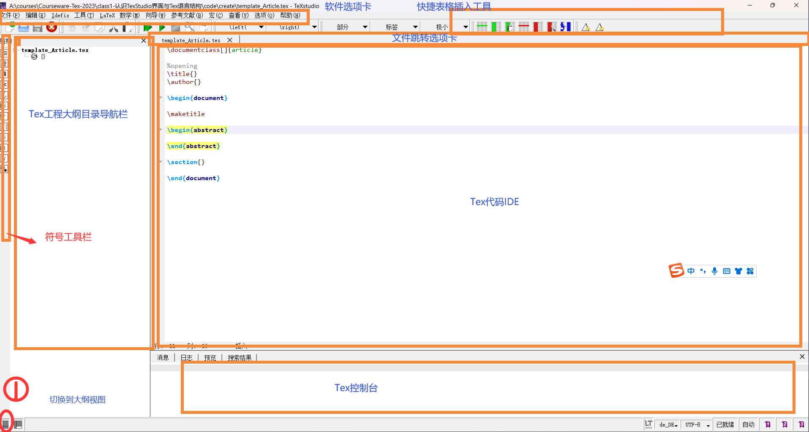
  
  - 编译你的Tex工程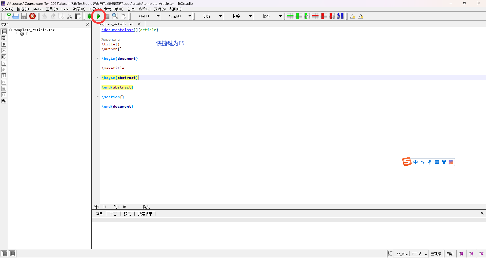
  - 编译你的Tex工程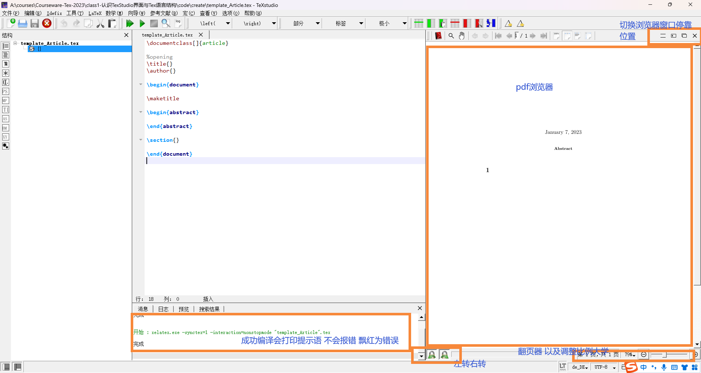

​				**注意：编译生成pdf文件后请勿在wps、 word等软件打开该pdf文件 只能在TexStudio中浏览 不然文件权限不足无法进行编译**

- 认识Tex工程文件目录

  - 找到刚才保存的目录 经过编译后文件夹下会有以下几个基础文件。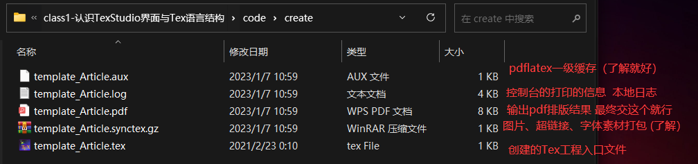

  ​		**注意：初学只要记住最终提交论文时只要提交这里的pdf文件即可**

  ​	**为了保证文件正确编译,文本格式都使用UTF-8,默认都是,不要用gbk**

## 认识Tex语言基础结构

 - **1.回到Tex的代码编辑框,刚才用Tex内置模板创建了工程，预置了基础结构。**
   - 基础内容
   - 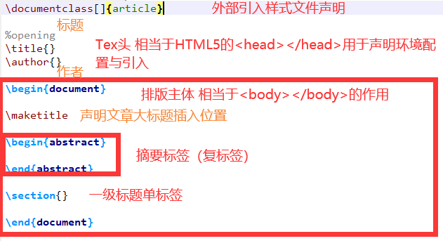    


- **2.尝试运用基础标签**

  - 向标签内插入基础内容

    ```tex
    \documentclass[]{article}
    %opening
    \title{Hello TexStudio}
    \author{Peitsan}
    \begin{document}
        \maketitle
        \begin{abstract}
            This is abstract.This is abstract.This is abstract.This is abstract.This is abstract.This is abstract.This is abstract.This is abstract.This is abstract.This is abstract.This is abstract.This is abstract.This is abstract.This is abstract.This is abstract.This is abstract.This is abstract.
        \end{abstract}
    \section{This is 1st section}
    \end{document}

  - 编译Tex,pdf浏览器出现如图的排版结果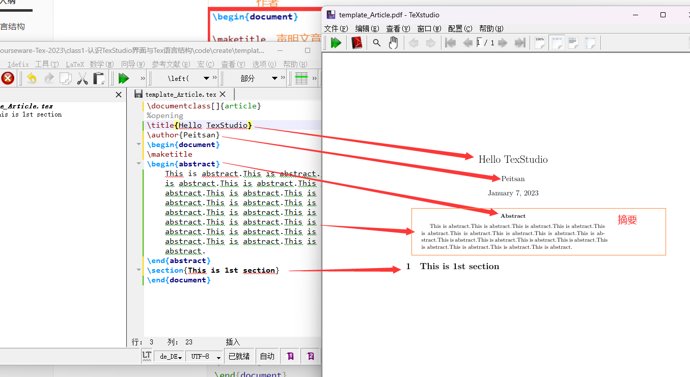

## 使用Tex搭建一个基础的数模论文模板

- **数模论文基本结构**
  - 0.Tex头
  	- 样式模板
  		```tex
          \documentclass{cls样式文件路径}
      ```
  	- 文章题目
  		```tex
          \title{题目的内容}
      ```
    - 文章关键词
  		```tex
          \keyword{题目的内容}
      ```
    - 引入宏包
  		```tex
          \usepackage{宏包包名}
      ```
    
  - 1. 摘要
  
  - **1.摘要的写法**
  
    - 1.按题目分点
  
      针对问题一，针对问题二......
  
    - 2.摆出结论
  
      将建立的模型公式，最优方案等，直接写在摘要里
  
    - 3.可以运用问题的分析
  
      将问题分析复制，然后删除精简
  
    - 4.关键词加粗
  
      包括使用到的模型方法、主要思想
  
    - 5.提炼中心 注意用词
  
      用词要咬文嚼字，必要时需要查字典，部分不熟悉的词语不要用。
  
    - 6.适当实例
  
      在论文中使用到的例子（论据）精简后写上
  
    - 7.句型模板	
  
       使用了XX信息，运用XX模型/方法,解决XX问题，得出XX结论。
  
  - **2.摘要的结构**
  
    - 1.摘要的结构
  
      - 总分式：
        `综述段，用到了模型方法，就XX进行研究，解决了XX实际问题。
         分述段落, 问题一中，对XX问题，根据XX方法，建立了XX数学模型，得出XX结论（S113、S116、S205等50家最重要的供应商，详见附录XX）`
  
      - 总分总式：
        ` 综述段，用到了模型方法，就XX进行研究，解决了XX实际问题`
         ` 分述段落, 问题一中，对XX问题，根据XX方法，建立了XX数学模型，得出XX结论（S113、S116、S205等50家最重要的供应商，详见附录XX）`
        `针对问题二.....针对问题三....`
  
        `总结段，本文解决了XX实际问题,具有XX实际意义，还可以XX改进。
	  
  - **3.摘要的标签**`
  	
    ```tex
          \begin{abstract}
          	摘要的内容
          \end{abstract}
  	```
  	
  - 2.目录
  
  - **插入目录的标签**
  
     ```tex
     	\tableofcontents
     ```
  
  - **Tex中插入目录标题的标签**
  
      - 一级标题
  
          ```tex
          \section{一级标题}
          ```
  
      - 二级标题
  
         ```tex
         \subsection{二级标题}
         ```
          	  - 三级标题
  
         ```tex
         \subsubsection{三级标题}
         ```
      - 四级标题
  
         ```tex
         \subsubsection{四级标题}
         ```
      - 伪标题
         ```tex
         \noindent{4.1四级标题}             %noindnent为去缩进
         ```
      
  - 一、问题重述
  
     - 1.写法
       
        -  1.分点
       将问题直接转述，不需要写问题背景或者问题推理分析
       不要照抄原文，解释一遍问题 用自己的语言再表述一遍
       
        -  2.篇幅
       
             		不宜超过半页,200字左右
  
     - 2.结构
  
       - 1.问题的背景
  
       - 2.问题的提出
  
         ```
         问题一：XXX
         
         问题二：XXX
         
         问题三：XXX
         ```
  
         
  
  - 二、问题分析
  
    - 1.结构
  
      - 1.问题的总体分析
  
      - 2.问题一的分析
  
      - 3.问题二的分析
  
      - 4.问题三的分析
  
    - 2.写法
  
      - 1.假设法
  
        ```
        假设写论文时还没有做过题，从提出问题的角度出发，找到切口。即记录从审题开始记录解决问题的过程。
        ```
  
      - 2.理论分析+社会分析
  
	      数学理论+社会实际分析
        	理论：某某模型有什么适用于这道题的地方，为什么想到了用这个模型
        	社会分析：找到数据的特征，特征-->模型适用处
        		人口基数很大，属于大数据类，
        		缺少一个社会分析的板块
      
  
	+ 三、模型的假设
	
    - 1.分点列出
  
      1.假设....
  
      2.假设...
  
    - 2.假设是无可奈何之举
  
      假设是当现有的所用模型与定理都无法解释的复杂现象，才应该用假设理想化。
  
   + 四、符号说明
  
        + 1.使用表格
        + 2.分两栏 （三栏）
             边符号 右边解释
   + 五、模型的建立与求解
  
        -  1.需要对每一个使用到的模型熟悉
            每一条公式附上一段解释性的话
            应该包括，该公式的 目的 、作用、 前因、后果
        -  2.需要和建模手做好沟通
        	决定使用某个模型后立刻去查找相关资料	
  
  + 六、模型的验证
     - 1.写法
     
      使用检验组数据回去检验
      使用一些描述值指标来说明优度
  
  + 七、模型的评价与改进
  	
  	 - 1.模型的优点
  	   - 1.使用到多个模型
  	   比较语句：对比模型间的优劣       谁在 某方面表现得比 另一个好，但 XXX又不如 另一个
  	
  	 - 2.使用单一模型
  	
  	- 2.模型的缺点
  	
  	- 3.模型的改进
  
  + 附录	
     - **1.插入附录的标签**
       
       - 1.在xelatex中
          ```tex
          \begin{appendixx}
       
        	\end{appendixx}
          ```
        - 2.在ctex中
       	 ```tex
          \begin{appendix}
          \end{appendix}
          ```
        - 3.在latex中
       	 
          ```tex
          \begin{appendices}
          \end{appendices}
          ```
     
  + 参考文献
  
    + **1.参考文献的标签**
    	- 不使用bibtex
    	```tex
          \begin{thebibliography}{9}%宽度9
          	\bibitem{bib:one}
          	\bibitem{bib:two}
          \end{thebibliography}
        - 使用bibtex
    	```tex
         	\bibliography{bib文件的路径}
      ```
  
   + 强制分页符
  		```tex
  		\newpage


## 手写一个Tex数模论文模板

- **示例代码**

```tex
\documentclass[]{article}   %样式模板
\usepackage{ctex}  %切换为中文
%opening
\title{Hello TexStudio}  %文章标题
\author{Peitsan}    %文章作者
\begin{document}  %Tex体
	\maketitle
	\begin{abstract}  %摘要
		This is abstract.This is abstract.This is abstract.This is abstract.This is abstract.This is abstract.This is abstract.This is abstract.This is abstract.This is abstract.This is abstract.This is abstract.This is abstract.This is abstract.This is abstract.This is abstract.This is abstract.
		
		
		这是摘要这是摘要这是摘要这是摘要这是摘要这是摘要这是摘要这是摘要这是摘要这是摘要这是摘要这是摘要这是摘要这是摘要这是摘要这是摘要这是摘要	这是摘要这是摘要这是摘要这是摘要这是摘要这是摘要这是摘要这是摘要这是摘要这是摘要这是摘要这是摘要这是摘要这是摘要这是摘要这是摘要这是摘要	这是摘要这是摘要这是摘要这是摘要这是摘要这是摘要这是摘要这是摘要这是摘要这是摘要这是摘要这是摘要这是摘要这是摘要这是摘要这是摘要这是摘要	这是摘要这是摘要这是摘要这是摘要这是摘要这是摘要这是摘要这是摘要这是摘要这是摘要这是摘要这是摘要这是摘要这是摘要这是摘要这是摘要这是摘要	这是摘要这是摘要这是摘要这是摘要这是摘要这是摘要这是摘要这是摘要这是摘要这是摘要这是摘要这是摘要这是摘要这是摘要这是摘要这是摘要这是摘要
	\end{abstract}

\newpage

	\tableofcontents %这是目录
	
\newpage
	\section{问题重述}
		\subsection{问题的背景}
		\subsection{问题的提出}
		
			\noindent\textbf{1.2.1 问题一}
			
			\noindent\textbf{1.2.2 问题二}
			
			\noindent\textbf{1.2.3 问题三}
			
	\section{问题分析}
		\subsection{问题一的分析}
		\subsection{问题二的分析}
		\subsection{问题三的分析}
	\section{模型假设}
		
	\section{符号说明}
%	表格语法下节课再讲
		\begin{center}
			\begin{tabular}{cc}
				\hline
				\makebox[0.45\textwidth][c]{符号}	& \makebox[0.45\textwidth][c]{意义}   \\ \hline
				Symbol  & Meanings \\ \hline
			\end{tabular}
		\end{center}
	
		\begin{center}
			\begin{tabular}{ccc}
				\hline
				\makebox[0.25\textwidth][c]{符号}	& \makebox[0.35\textwidth][c]{意义} & \makebox[0.2\textwidth][c]{单位}	 \\ \hline
				Symbol  & Meanings & Units\\ \hline
			\end{tabular}
		\end{center}
\newpage
	\section{模型的建立与求解}
		\subsection{问题一的模型}
		
				\noindent\textbf{5.1.1 数据预处理}
				
				\noindent\textbf{5.1.2 模型的建立}
				
				\noindent\textbf{5.1.3 模型计算求解}
				
				\noindent\textbf{5.1.4 问题一的结论}
		\subsection{问题二的模型}
		\subsection{问题三的模型}
\newpage
	\section{模型的验证}
		\subsection{问题一的检验}
		\subsection{问题一的检验}
		\subsection{问题一的检验}
\newpage
	\section{模型的评价与改进}
			\subsection{模型的优点}
			\subsection{模型的不足}
			\subsection{模型的改进}
					
\appendix 
	\renewcommand{\appendixname}{Appendix~\Alph{section}}
	\section{附表1——XXXXXX}
	
\newpage	
\begin{thebibliography}{9}%宽度9
	\bibitem{bib:one}
	\bibitem{bib:two}
\end{thebibliography}

\end{document}
```

- **示例效果**

  - 1.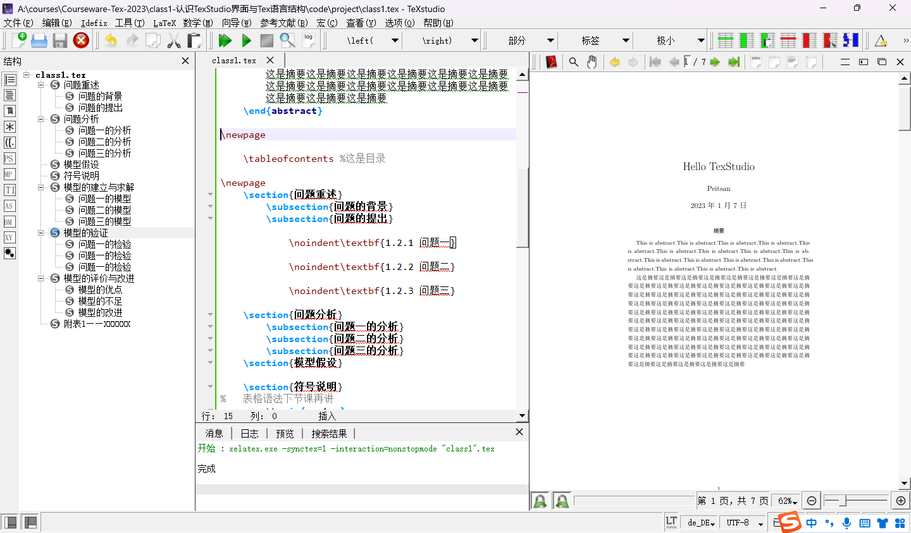
  - 2.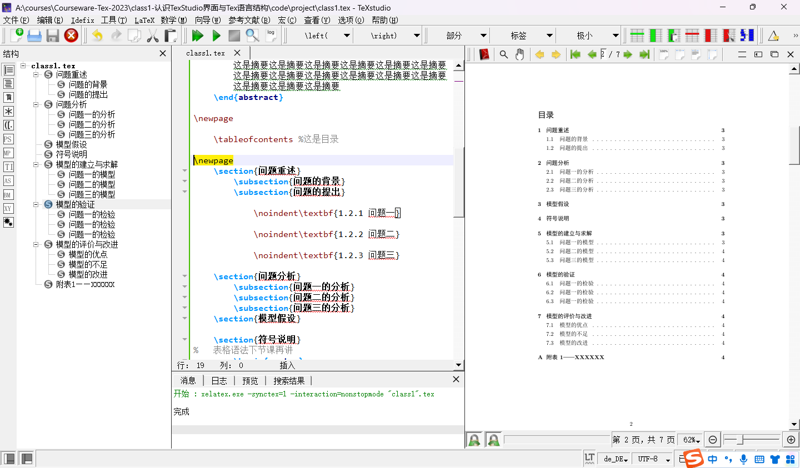
  - 3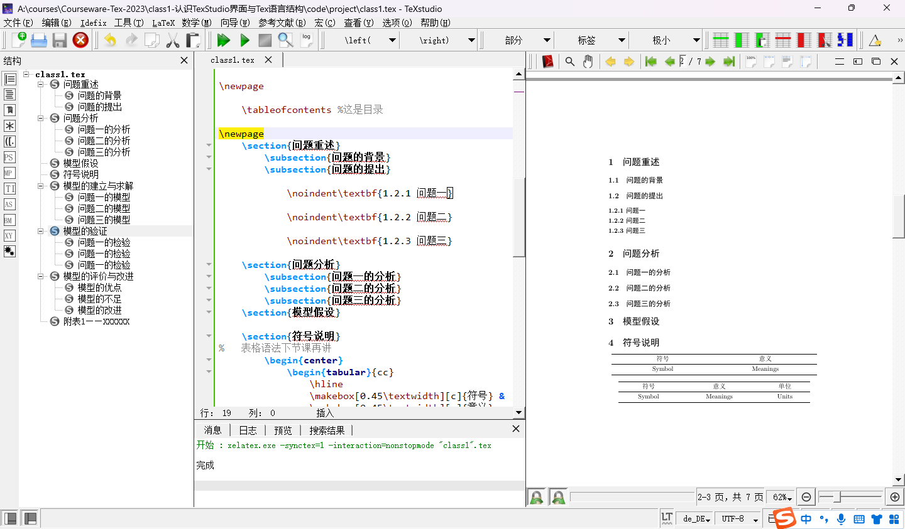
  - 4.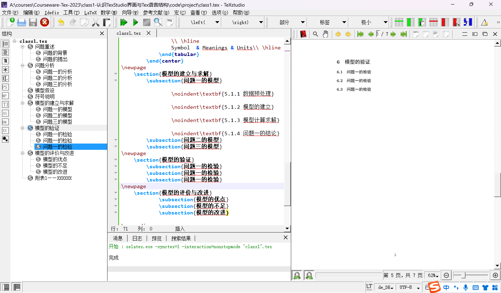

  - 5.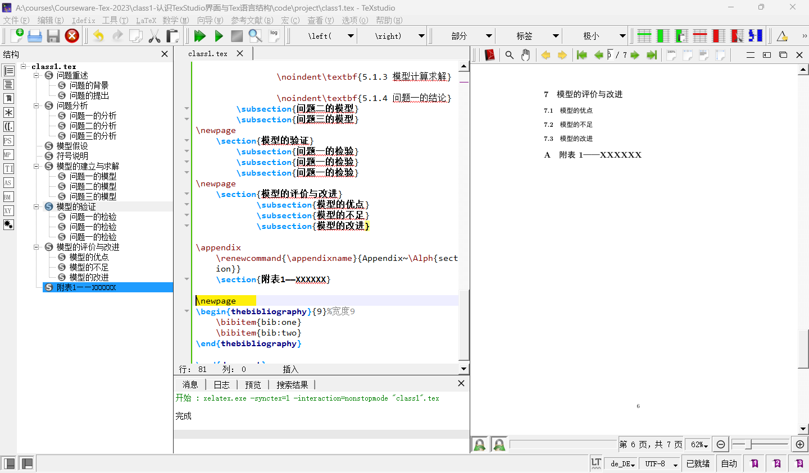
  - 6.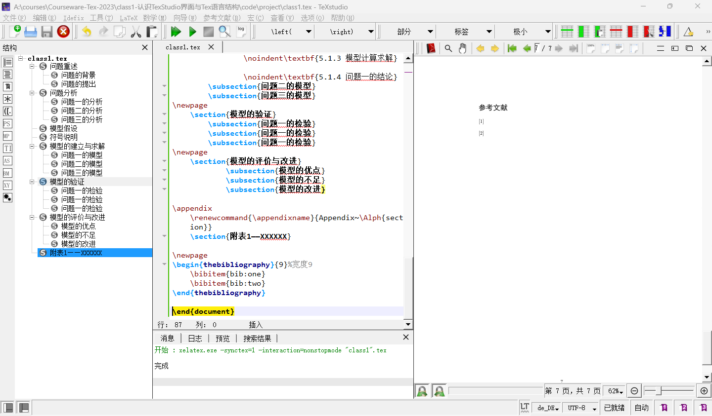


- % 快捷键 ctrl + T
- 分页符 \newpage
- 换行符 \\\
- 插入书签 快速断点
