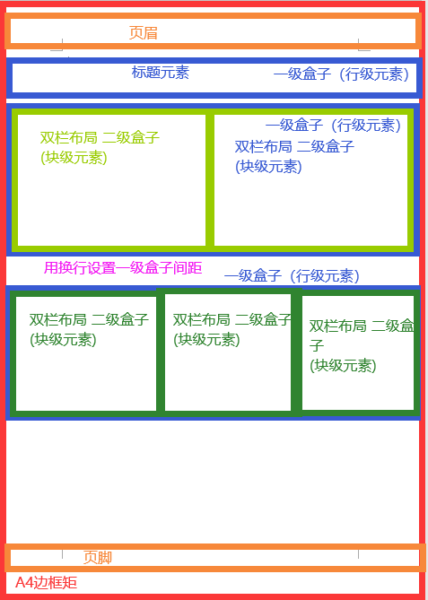
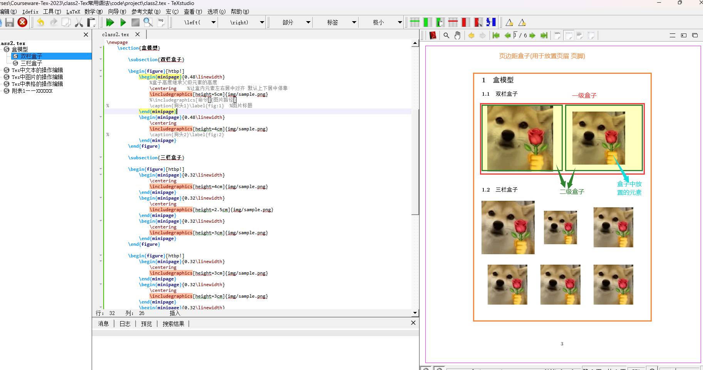

# Tex常用语法

## 	Tex中的盒子模型
- 1.盒子模型(Box)
	- 概念:盒子模型是一个布局概念。一个pdf文件中包含有多种元素: 文本、图片、表格、超链接等。怎么确定元素的位置,就需要用到布局,常用的Tex布局有：盒模型、网格布局、浮动布局。
	
	- 由于页面布局(layout)技术段位较高,本文为了应付数模论文需求，只将最基础的盒模型布局,其他的布局方案可以参照这些文章自己钻研：
	  [ 1.如何使用Tex，Latex，ConTeXt创建自定义布局/更改标题背景颜色？](https://www.coder.work/article/6318932)
	   [2.Tex之版面布局设计](https://blog.csdn.net/weixin_33834679/article/details/91996622)
	
	- 盒模型的设计思维：
	
	  
	
	- 在Tex中实现盒模型布局:
		- 分栏标签:
 ``` tex
                \begin{父标签}[!htpb]
                        \begin{minipage}{占父级标签的宽度百分比\linewidth}
                        %子标签中的高度会继承父标签的高度
                        \end{minipage}
                        \begin{minipage}{占父级标签的百分比\linewidth}
            
                        \end{minipage}
                \end{父标签}
 ```
-   2.盒子模型实例:
  -   1.双栏排版:
    ```tex
           \begin{figure}[htbp!]
                \begin{minipage}{0.48\linewidth}
                    %盒子高度继承父级元素的高度
                    \centering    %让盒内元素左右居中对齐 默认上下居中停靠
                    \includegraphics[height=5cm]{img/sample.png}
                    %\includegraphics[命令]{图片路径}
    %				\caption{狗头1}\label{fig:1}  %图片标题
                \end{minipage}
                \begin{minipage}{0.48\linewidth}
                    \centering
                    \includegraphics[height=4cm]{img/sample.png}
                \end{minipage}
            \end{figure}
    ```

  - 2.三栏排版:
     ```tex
                        \begin{figure}[htbp!]
                    \begin{minipage}{0.32\linewidth}
                        \centering    
                        \includegraphics[height=4cm]{img/sample.png}
                    \end{minipage}
                    \begin{minipage}{0.32\linewidth}
                        \centering    
                        \includegraphics[height=2.5cm]{img/sample.png}
                    \end{minipage}
                    \begin{minipage}{0.32\linewidth}
                        \centering
                        \includegraphics[height=3cm]{img/sample.png}
                    \end{minipage}
                \end{figure}
     ```
    - 盒子排版效果
- 3.Tex中常用到的布局间距标签(了解)
    ```tex
    % ================= 设置版面，A4 页面高 29.7cm, 宽 21.0cm ================ %
    % 1英寸(inch) = 2.54 cm
    % 水平左边空距，默认为 1in + \hoffset %
    \setlength{\hoffset}{-0.54cm}
    % 垂直上边空距，默认为 1in + \voffset %
    \setlength{\voffset}{-0.54cm}
    % 纸张内侧边界: 水平边空距 + \oddsidemargin (奇数页的左边界) = 2.00cm %
    \setlength{\oddsidemargin}{0cm}
    % 纸张外侧边界: 水平边空距 + \evensidemargin (偶数页的左边界) = 2.00cm %
    \setlength{\evensidemargin}{0cm}
    % 版心 17.0cm + 内侧边界 2.00cm + 外侧边界 2.00cm = 21.0cm %
    \setlength{\textwidth}{17.0cm}
    % 上页边到页眉的距离 %
    \setlength{\topmargin}{0.90cm}
    % 标题行高度 %
    \setlength{\headheight}{0.55cm}
    % 正文到标题的间距 %
    \setlength{\headsep}{0.45cm}
    % 正文底部到页脚距离 %
    \setlength{\footskip}{0.90cm}
    % 版心高度 22.90cm + 上页边空距 2.00cm + 页边页眉距 0.90cm + 标题行高 0.55cm %
    %         + 正文标题距 0.45cm + 正文页脚距 0.90cm + 下页边空距 2.00 = 29.70cm %
    \setlength{\textheight}{22.90cm}
    % ============================================================================== %
    \renewcommand{\baselinestretch}{1.2}                                % 行距
    \setlength{\parskip}{2.0ex plus0.1ex minus0.2ex}                 % 段落间距
    \setlength{\parindent}{0.6cm}                                        % 段首缩进
    \renewcommand{\CJKglue}{\hskip 0pt plus 0.08\baselineskip}         % 汉字字距
    ```
    
    ## 	Tex中文本的操作编辑
    - 1. 缩进与空格
         - 1. Tex中段落默认首行缩进
         - 2.取消首行缩进：
    		          在段落最前面添加 \noindent 
    		
    		 - 3.Tex直接用空格键敲空格是不会生效的,必须用如下的空格转义符。
                    ```tex
                                        %latex中通常会设置基单位m作为尺寸的比例尺基,一般设置m = 2cm;
                                        a \qquad b % 空格两个m的宽度
                                        a \quad b  % 空格一个m的宽度
                                        a\ b 	   % 空格1/3m的宽度
                                        a\;b 	   % 空格2/7m的宽度
                                        a\,b 	   % 空格1/6m的宽度
                                        a\!b 	   % 靠近紧贴1/6m的宽度
                    ```
	- 2. [加粗、斜体、下划线、正文仿宋](https://blog.csdn.net/weixin_36670529/article/details/106468778)	
         - 1.加粗：\textbf{加粗文字}
         - 2.斜体：\textit{变斜体强调文字}
         - 3.下划线：\underline{下划线}	
         - 4.正文仿宋：\texttt{正文仿宋}	
## 	Tex中图片的操作编辑

## 	Tex中表格的操作编辑

## 	Tex中的操作编辑