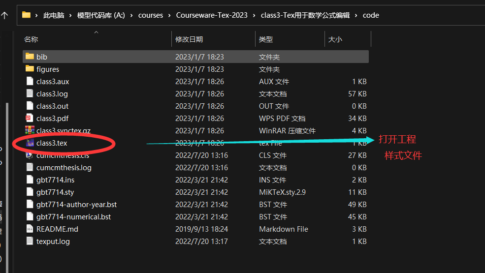

# Tex用于数学公式编辑

**注:本节课重在操作,本节课用的课程代码一定要提前下载到本地,因为引入了样式模板 **

## 引入样式模板

- 1.下载本套课件到本地
- 2.依次打卡文件夹"class3-Tex用于数学公式编辑"—>“code”,找到预置的Tex工程
- 3.可以看到预置工程中有一个样式文件“cumcmthesis.cls”,文件中已经声明宏包等Tex头信息
- 4.打开class3.tex,选择用TexStudio打开
## 认识数学公式Tex环境
- 1.公式块级标签环境

  - 环境声明标签

    ```TEX
    \begin{equation}
    	公式内容
    \end{equation}
    ```

- 2.公式行级标签环境

  - 单行嵌入公式环境

    ```TEX
    $公式内容$     
    实例:
    本模型中令温度为$\tao$,热量为$\gamma$,可以计算出...
    ```

  - 多行行级公式环境 

    双美元符表示多行公式输入,但是显示在同一行上同样可以插在文段之间,每段公式最后使用换行符\\\换行。

    ```TEX
    $$
    	公式1内容  \\
    	公式2内容  \\
    	公式3内容 
    $$
    ```
## 公式序号管理

- 1.使用equation环境会自动编号

- 2.为了便于阅读批卷,还是推荐用"章节-小节-节内公式序号"的格式进行编号,但需要手动编号管理

  - 编号命令 \tag{章节-小节-节内公式序号}

  - 实例:

    ```tex
    \begin{equation}
    	\tag{2-1-1}
    		f(x)= \frac{\sum_{i=0}^{n}}{n}
    \end{equation}
    \begin{equation}
    	\tag{2-1-2}
    	s(x)= \lim_{x\rightarrow\infty\sum_{i=0}^{n}f(x)
    \end{equation}
    ```

## 简单公式编辑

- 1.希腊字母、特殊符号、单位符号等

  ```tex
  $\alpha \quad \beta \quad \gamma \quad \lambda \quad \theta \quad \xi \quad \eta \quad \sigma \quad \chi \quad \psi \quad \phi \quad \mu \quad \varphi \quad \omega$
  		
  	$A \quad B \quad \Gamma \quad \Lambda \quad \Theta \quad \Xi \quad E \quad \Sigma \quad X \quad \Psi  \quad \Phi\quad V U \quad \quad \Omega$	
  	
  $\pi \quad \times \textdiv \quad \cdot \quad \sim \quad\surd \leq \quad \geq \quad\gtrapprox \quad \|X\|  $
  	  
  	  $\cos \quad \sin \quad \textdiv \quad \arg  \quad\cdot \quad \lim \quad \ln \quad  \log \hat{x} \quad \vec{x} \quad  \widehat{abc} \quad \tilde{a} \quad \dot{a}$
  	  
  	  	$ \textdegree \quad \textcelsius \quad \textohm \quad \S \quad \textpertenthousand \quad \textperthousand \quad \textyen \quad
  	$
  ```

- 2.上下标、分数、积分、导数等运算符

  ```tex
  $
  	x^{n}  \quad x_{k}  \quad x^{n}_{k} 
  $
  
  $
  		f(x) = \int_{a}^{b}e^{x}dx
  $
  
  $ 
  	f'(x) \quad f''(x) \quad f'''(x) \quad f^{n}(x)
  $
  ```

- 3.无理数、无穷、极限

  ```tex
  $ \sqrt{x}  \quad ^3\sqrt{x}\quad \infty $
  	\begin{equation}
  		\lim_{x\rightarrow\infty}
  	\end{equation}
  ```

- 4.级数、重级数

  ```tex
  \begin{equation}
  		ln (1-x) = x+x^2+x^3 \cdots x^n \cdots  = \lim_{N\textrightarrow\infty}\sum_{n=1}^{N} x^n
  	\end{equation}
  
  	\begin{equation}
  	\sum_{n=1}^{N} \sum_{k=1}^{n} \frac{1}{x^{k}}
  	\end{equation}
  ```

- 5.集合、概率、逻辑运算

  ```tex
  $	
  		\circ \quad \bullet \quad\subseteq \quad \supseteq \quad \supsetneqq \quad \subsetneqq \quad \quad \bigodot  \quad \oplus \quad \otimes  \quad \bigcap \quad \bigcup \quad \complement  \quad \bigwedge \quad \bigvee
  	$
  ```


  ​		 
  ```tex
  	 $ 
  	  \{(x,y) | x<R \;,y<R\}
  	  $
  	  
  	 $ 
  	  A = \complement_{D}B \bigcap E
  	  $
  	  
  	   $ 
  	   	p(y^{*}\mid x^{*},X,Y) = \int p(y^{*}\mid f^{*})p(f^{*}\mid x^{*},X,Y)df^{*}
  	   $ 
  	   
  	   $ 
  	   	AB \bigodot C \oplus D \bigwedge E \subseteq F
  	   $ 
  ```

## 高阶公式编辑
- 1.多行公式

  ```tex
  \begin{equation}
  		\begin{split}
  			&\Gamma(w,b) = \frac{a}{\|W\|} \\
  			&Max_{(w,b)}  \Gamma \\
  			&s.t \quad  y_{i}(w^{T}x_{i}+b) \geq 1, \quad i =1,2,\cdots,m.
  		\end{split}
  	\end{equation}
  ```

- 2.大括号、矩阵

  ```tex
  \begin{equation}
  		\left\{
  		\begin{split}
  			x  = \rho+ r cos\theta \\
  			y = \rho + r sin\theta \\
  		\end{split}\right
  	\end{equation}
  
  	\begin{equation}
  			C(x,x')=\begin{bmatrix}
  				c(x_{1},x'_{1}) &	c(x_{1},x'_{2})&\cdots&	c(x_{1},x'_{n}) \\
  				c(x_{2},x'_{1}) & 	c(x_{2},x'_{2})	&\cdots&	c(x_{2},x'_{n})\\
  				\vdots & \vdots & \ddots &\vdots \\
  				c(x_{n},x'_{1})& 	c(x_{n},x'_{2})& 	\cdots&	c(x_{n},x'_{n})	
  			\end{bmatrix}
  		\end{equation}
  ```

- 3.复杂逻辑带箭头

  ```tex
  \usepackage{witharrows}%带箭头公式宏包
  	\begin{equation}
  	\begin{WithArrows}
  		A & = (a+1)^2 \Arrow{我们展开} \\
  		& = a^2 + 2a + 1
  	\end{WithArrows}
  \end{equation}
  ```

- 4.带条件公式

  ```tex
  \begin{equation}
  				L=\mid F_{0}F_{k}\mid ,\quad k\in(0,10)	
  		 \end{equation}
  ```

- 5.优化目标函数

  ```tex
  \begin{equation}
  		\begin{split}
  			Loss_{k} & = \frac{(\rho_{k}' - \rho_{k})^{2}}{\sum_{k=2}^{9}(\rho_{k}' - \rho_{k})^{2}} + \frac{(\theta_{k}' - \theta_{k})^{2}}{\sum_{k=2}^{9}(\theta_{k}' - \theta_{k})^{2}}  \\
  			&min\quad\sum_{k=2}^{9}Loss_{k}
  		\end{split}
  	\end{equation}	
  ```

- 6.长公式规范书写

```tex
	\begin{equation}
	\tag{不规范}
	\begin{split}
		k'_{i}&= \sum_{i}( \sum_{i}+ \sum_{i+1})^{-1}\\
		&= \frac{H_{k'_{i}}P_{k'_{i}}H_{k'_{i}}^{T}}{H_{k'_{i}}P_{k'_{i}}H_{k'_{i}}^{T}+R_{k'_{i}}} \\
		U'&= U_{i}+ k'(U_{i+1}- U_{i}) \\
		\sum'& = \sum_{i} - k'_{i}\sum_{i} \\
		P'_{k'}& =P_{k}-k'H_{k'_{i}}P_{k}
	\end{split}
\end{equation}
```

**注意: 查看代码效果请用TexStudio打开,本节课重在实操**