# Tex文献引用

## 什么是文献管理、文献引用的严肃性

- 数模国赛中的文献引用要求

  - 所有引用他人或公开资料(包括网上资料)的成果必须

    [^[1\]]: 

    按照科技论文的规范 列出参考文献，并在正文引用处予以标注。

    **一、论文正文中的参考文献标注方式**

  - **01**、正文引用处用方括号标示参考文献的编号，如[1]、[3]等;引用书籍必须指出页码。

  - **02**、参考文献按正文中的引用次序列出

    **二、论文结尾的参考文献**

  - **01**、参考文献按正文中的引用次序列出

  - **02**、引用书籍的表述方式为：

    [编号] 作者，书名，出版地：出版社，出版年。

  - **03**、引用期刊杂志论文的表述方式为：

    [编号] 作者，论文名，杂志名，卷期号：起止页码，出版年。

  - **04**、引用网上资源的表述方式为：

    [编号] 作者，资源标题，网址，访问时间（年月日）。

    **三、附录中的引用支撑**

  - **01**、附录中，应提供参赛者实际使用的软件名称、命令和编写的全部计算

    机源程序（若有的话）。

  - **02**、赛题中提供的原始数据不必写入附录。

- [数模美赛中的文献引用要求]()

  **一、论文正文中的参考文献标注方式**

  - **01**、论文中注明参考文献作者时，只列出相关作者的姓氏，中文姓名也用拼音列出其姓氏。当引用的作者是一位时，按下列方式列出：
    Long  Wong and Yu(1991) argues that ….
    Zhang (2001) argues that …
    当引用的作者为二至三位时，按下列方式列出：
    Perkins and Gass (1996) argue that….
    Zhang, Li and Wang (1996) argue that …
    当引用的作者超过三位时，只列出第一位作者，其他的作者用缩写et al.表示:
    Sanders et al. (1992) studied coherence relations ….

  - **02**、需要注明参考文献的具体页码时使用冒号,冒号和页码之间空一格：
    Messick (1989: 20) presents …
    Hu (1994: 5-6) points out that …

  - **03**、直接引用文献时，如所引用的内容超过50单词，应另起一段，左右缩进两个字符：
    Lorenz (1999: 55) voiced a very similar view that because in written communication, coherence cannot be explicitly negotiated face-to-face between text producer and text receiver,
    writers therefore have every reason for trying to be unequivocal and to make their ideas, intentions and arguments unmistakably clear. One way of doing this is to carefully signal logical relations and thereby ‘signpost’ the path to coherence for the reader. Consequently, when looking at the fabrication of coherence in written discourse, we need to pay special attention to those explicit signposts of coherence, i.e. the text’s cohesive ties.

  - **04**、在句尾注明参考文献作者时，句号应在括号之外。直接引用部分用斜体字表示（一般不在论文中用引号）。作者人数多于三人时采用et al.缩写表示。例如：
    The first criticism is that the text-based researchers choose to study the text itself for methodological convenience (Givón 1995: 59).
    During the 1970s there were considerable moves within language teaching to embrace the communicative approach (Brumfit et al. 1979: 21).

  - **05**、引用间接材料  
    If construct validity is seen as … in the short run (Shepard 1993: 444, cited in Chapelle 1998).
    - 在文献[1]中
    
  - **06**、引用中文文献
    在英文论文中引用中文文献，要按英文论文的引文格式注明作者和出处。比如：
    For example, text studies in the 1960s and early 1970s were more or less concerned with text grammar and textual grammaticality (Hu 1994: 5-6).
    These scholars chose to study coherence as a social phenomenon, rather than a mental phenomenon (Zhu & Yan 2001).
  
  - **07**、引用多篇参考文献时，作者按姓氏字母顺序排列
    The situation with accuracy is not so clear. Some studies (e.g., Foster & Skehan 1996; Mehnert 1998; Skehan & Foster 1997) do suggest that accuracy is raised when there is planning, but other studies (e.g., Crookes 1989; Ortega 1999; Wigglesworth 1997, 2001) do not support this claim.
  
  - **08**、一位作者有多篇著作被引用时，著作按出版年代顺序排列
    According to Halliday (1973, 1978, 1985, 1994), language has three main metafunctions, namely, ideational metafunction, interpersonal metafunction and textual metafunction.
    However, McNamara (1995; McNamara & Lumley 1997) has challenged the Bachman model.
    However, researchers have challenged the Bachman model (McNamara 1995; McNamara & Lumley 1997).
  - **09**9、同一作者同一年内有两篇以上文献被引用时，用a, b, c顺序表示：
    He draws up a possible research agenda that would flow from the inclusion of a social perspective – and in-deed such a research agenda has already borne fruit in several studies of the nature of the interaction in oral tests (Porter 1991a, 1991b).
  
  - **10**、 作者姓氏相同时，要注明名字的缩写，并按名字的字母顺序排列：
    M. Dawkins (1980) and R. Dawkins (1986) have contributed to an understanding of consciousness in animals.
  - **11**11、 参考文献是某个刊物而无作者时，注明刊物的名称和时间。例如：
    According to a national study (Education Week, January 13, 2000), 49 of the 50 states have adopted standards …
  - **12**、 参考文献引用某个单位的刊物而无具体作者时，列出时间即可。例如：
    According to the Council of Chief State School Officers (1998), 47 states publicly report test scores.
  
  **二、论文结尾的参考文献**
  
  - 为避免作者姓名缩写后出现同名现象，目前主流语言学杂志的倾向是在参考文献中不再使用缩写来表示作者的名字，而是使用全称[1]。西文作者的中间名不用标注出来。书名要用斜体标注。要列出出版地和出版社，中间用冒号分隔。书名和专有名词均只大写单词的首字母，三个字母以下的介词和连词的首字母不大写。折行时缩进2个字母。
  - **01** 、参考文献为一位作者
    Connor, Ulla. 1996. Contrastive Rhetoric: Cross-cultural Aspects of Second Language Writing. New York: Cambridge University Press.
  - **02、**参考文献多于一位作者时，不要使用 et al（与文中引用的格式不同），用&替代and。
    Brown, Gillian & Yule, George. 1983. Discourse Analysis. Cambridge: Cambridge University Press.
    Butt, David & Fahey, Rhondda & Spinks, Sue & Yallop, Colin. 1995. Using Functional Grammar: An Explorer’s Guide. Macquarie University: National Centre for English Language Teaching and Research.
  - **03**、参考文献是学术刊物中的论文
    需标注论文所在刊物的名称、卷号（volume number）和论文相关页码。刊物的名称用斜体标注。如果所引用期刊的整卷统一编排页码（即一卷中的若干期连续编排页码），那么在参考文献中不需要提供期号（issue number），只需提供卷号和页码。只大写论文题目第一个单词的首字母。冒号或分号后面单词的首字母要大写。刊物名称按书名处理。
    Ouhalla, Jamal. 1993. Subject-extraction, negation and the anti-agreement effect’,
    Natural Language and Linguistic Theory 11, 477–518.
    如果每一期单独编排页码（即每期从第1页开始），那么则需要提供期号。例如:
    Bateman, John. & Rondhuis, Klaas. 1997. Coherence relations: Towards a general specification. Discourse Processes, 24 (1), 3-49.
  - **04**、 参考文献是论文集
    主编是一个人时用（Ed.）,两人以上用（Eds.）例如：
    Couture, Babara. (Ed.). 1986. Functional Approaches to Writing: Research perspectives. Norwood, NJ.: ABLEX Publishing.
    Bublitz, Wolfram.& Lenk, Uta & Ventola, Eija. (Eds.). 1999. Coherence in Spoken and Written Discourse. Amsterdam/Philadelphia: John Benjamins Publication Company.
  - **05**、 参考文献是论文集中的论文
    此时作者姓名均为全称，论文集编者姓为全称，名为缩写。例如：
    Kihm, Alain. 2001. Noun class, gender, and the lexicon-syntax-morphology interfaces, in R. Kayne & G. Cinque (eds.), Handbook of Comparative Syntax. Oxford/New York: Oxford University Press.
  - **06**、 参考文献是会议论文
    Jochens, John. 1992. Gender equality in law? Paper presented at the 26th Annual Conference of the Center for Medieval and Early Renaissance Studies, Binghamton, New York.
  - **07**、参考文献是未出版的博士论文
    论文名按书名处理。
    Boukhris, Fatima. 1998. Les Clitiques en Berbe`re Tamazighte, unpublished Ph.D. dissertation, University Mohamed V, Rabat.
  - **08**、参考文献是网上的资料
    除了注明资料来源的网址外，还要注明查阅资料的日期或下载资料的日期，因为不同时间的网上资料的内容会发生变化。例如：
    Franks, Steven. 2005. Bulgarian Clitics are positioned in the syntax.
  
  [http://www.cogs.indiana.edu/people/hompages/franks/Bg_clitics_remark_dense.pdf](https://link.zhihu.com/?target=http%3A//www.cogs.indiana.edu/people/hompages/franks/Bg_clitics_remark_dense.pdf)
  (17 May, 2006)
  
  - **09**、参考文献是中文
    将文献名、作者、年代等出版信息译成英文，并把中文信息放在括号内。
    Hu, Zhuanglin. 1994. Discourse Cohesion and Coherence. Shanghai: Shanghai Foreign Language Education Press.（胡壮麟，《语篇的衔接与连贯》，上海外语教育出版社。）
    Zhu, Yongsheng. & Yan, Shiqing. 2001. Reflections on Systemic-Functional Linguistics. Shanghai: Shanghai Foreign Language Education Press.（朱永生 严世清，《系统功能语言学多维思考》，上海外语教育出版社）。
  - **10** 、参考文献是某个刊物而无作者
    Education Week. January, 1997. Quality counts 1997: A report card on the conditions of education in 50 states.
  - **11**、参考文献是某个单位的刊物而无具体作者
    Council of Chief States School Officers. 1998. Annual Survey of State Student Assessment Programs. Washington, DC: Author.
  - **12**、参考资料排序
    - (1)按作者姓氏的字母顺序排序。
    
      Oilver,Ouhalla, Zeta 
    
    - (2) 同一作者有多个参考文献时，按年代由远及近排序。例如：
      Ouhalla, Jamal. 1991. Functional Categories and Parametric Variation, Routledge: London.
      Ouhalla, Jamal. 1993. ‘Subject-Extraction, Negation and the Anti-agreement Effect’, Natural Language and Linguistic Theory 11, 477–518.
    - (3) 同一作者单独完成的文献优先于该作者与他人合作的文献。例如：
      Halliday, Michael. 1994. An Introduction to Functional Grammar (Second Edition). London: Edward Arnold.
      Halliday, Michael & Hasan, Ruqaiya. 1976. Cohesion in English. London: Longman.
    - (4) 西文姓名前缀van, de等也按姓氏排序。例如：
      Chomsky, Noam. 1995. The Minimalist Program, MA: MIT Press.
      de Beaugrande, Robert. 1980. Text, Discourse, and Process: Towards a multidisciplinary science of texts. Norwood, NJ.: ABLEX Publishing.
    - (5) 中文文献翻译成英文之后，与其他英文文献一起按字母顺序排列，如：
      Ouhalla, Jamal. 1991. Functional Categories and Parametric Variation. London: Routledge,Zhu, Yongsheng. & Yan, Shiqing. 2001. Reflections on Systemic-Functional Linguistics. Shanghai: Shanghai Foreign Language Education Press.（朱永生 严世清，《系统功能语言学多维思考》，上海外语教育出版社。）

## Tex中进行文献引用

 - 不使用bibtex

   - 输入这段代码

     ```tex
     \begin{thebibliography}{9}%宽度9
     		\bibitem{bib:one} 
     		\bibitem{bib:two}
     	\end{thebibliography}
     ```

   - 引入citation宏包

     ```tex
     \usepackage{cite} %引入cite文献管理宏包 若使用样式模板 则不用重复引用
     ```

   - 使用\cite{}命令引入

     - 引用方法: 在文本之间的位置\cite{}

 - 使用bibtex

   - 引入bibtex宏包
   
     ```tex
     \usepackage{bibtex} %引入bibtex宏包
     ```
   
   - 引入bibtex文献引用样式
   
     ```tex
     \bibliographystyle{bst样式文件路径}
     ```
   
   - 新建bib文件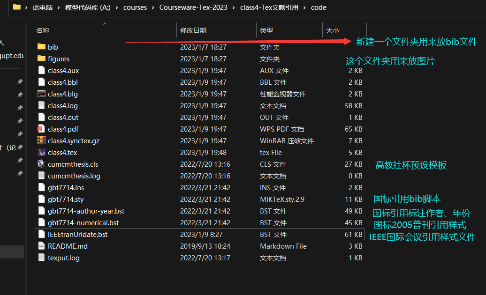
   
     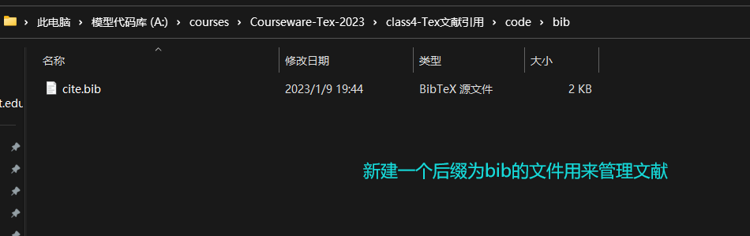
   
   - 打开bib文件写入文献数据
   
     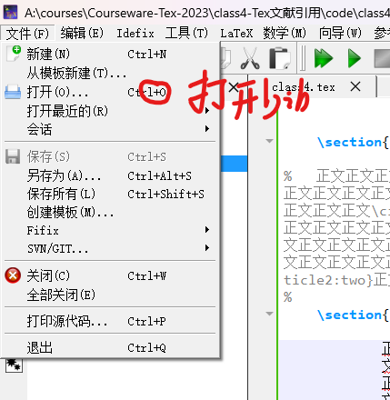
   
   - 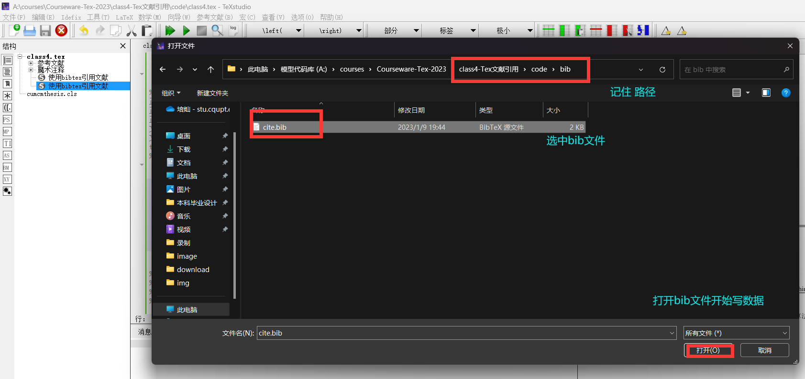
   
   - 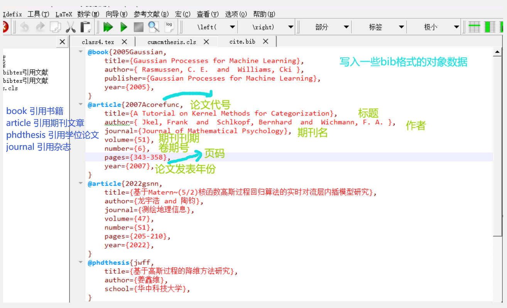
   
     ```tex
     @book{论文代号(英文不要用中文),
     	title={论文名},
     	author={ 作者 },
     	publisher={出版社},
     	pages={页码},
     	year={发表年份},
     }
     @article{论文代号(英文不要用中文),
     	title={论文名},
     	author={作者 },
     	journal={期刊名},
     	volume={期刊刊期},
     	number={卷期号},
     	pages={页码},
     	year={发表年份},
     }
     @phdthesis{论文代号(英文不要用中文),
     	title={论文名},
     	author={作者},
     	school={毕业院校},
     } 
     ```
   
     
   
   - 导入bib文件到tex
   
     - `\bibliography{bib文件路径}`
   
     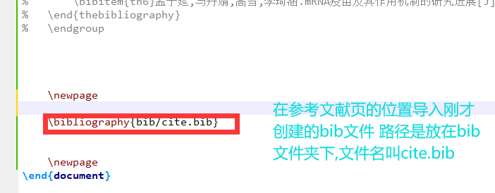
   
   - 引入citation宏包
   
     ```tex
     \usepackage{cite} %引入cite文献管理宏包 若使用样式模板 则不用重复引用
     ```
   
   - 使用\cite{}命令引入
   
     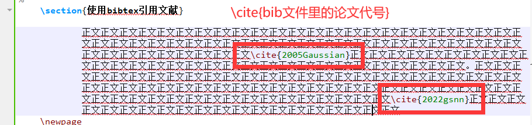
   
   - **注意、cite要用上角标**
   
   - **使用bib命令对bibtex进行编译**
   
     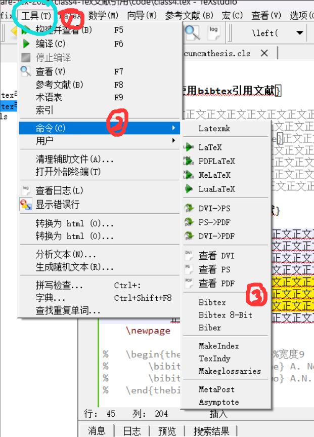
   
     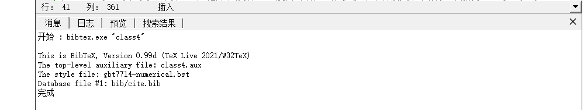
   
   - 最终编译Tex工程,如果没有正确显示，出现问号等,多重复几次编译即可
   
     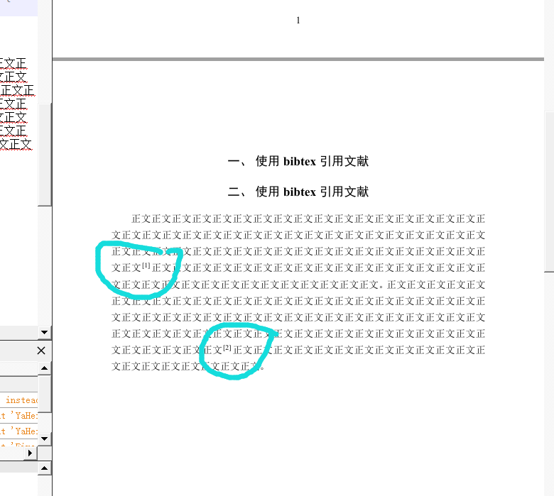
   
     

## bibtex的引用样式

- 重定义bib标题

  - 使用\begingroup进行\renewcommand

    ```tex
    \section{Reference}
    	\begingroup  % 去掉thebibliography环境自带的“参考文献”标题
    	\renewcommand{\section}[2]{}  % 用一级标题代替参考文献标题
    	\begin{thebibliography}{99}  % 引入bib环境
    		\addtolength{\itemsep}{-1.5ex}  % 缩小行距
    		\bibitem{th1}李珍,郑芳,程范军.感染性疾病mRNA疫苗的研究进展[J].华中科技大学学报(医学版),2021,50(02):234-239+246.
    		\bibitem{th2}陈彦,孙英.mRNA疫苗研究进展——2021年拉斯克奖临床医学研究奖[J].首都医科大学学报,2021,42(05):893-899.
    	\end{thebibliography}
    	\endgroup
    ```

    

- 切换bib引用样式

  - 导入其他的引用格式文件

    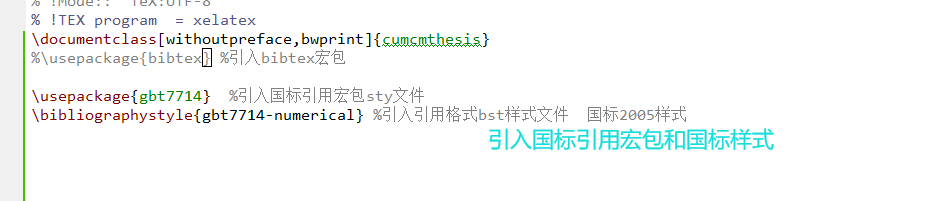

    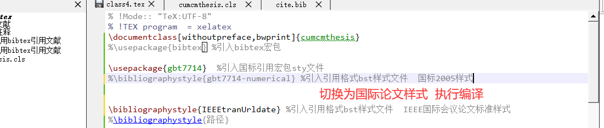

    可以看到引用样式变化了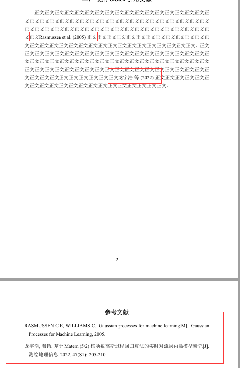

  - 使bibJSON数据缺省

## bibtex格式JSON检索

​	**使用学术检索引擎**

​	支持bibtex格式引用的学术检索网站有

- **01**、[谷歌学术](https://scholar.google.com/)
- **02**、[谷粉学术(镜像站)](https://gfsoso.99lb.net/)
- **03**、[百度学术](https://xueshu.baidu.com/)
- **04**、[深度学术检索]([学术优质资源搜索‬xs2 (studiodahu.com)](https://xs2.studiodahu.com/))
- **05**、[爱思唯尔](https://www.sciencedirect.com/)
- **06**、[BASE](https://www.base-search.net/)
- **07**、[Vascoda](https://www.vascoda.de/)
- **08**、[Goole](http://www.goole.com/)
- **09**、[亚马逊A9](http://www.a9.com/)
- **10**、[中文Cnp全连接](http://cnplinker.cnpeak.com/)
- **11**、[citeseer](https://citeseer.ist.psu.edu/)
- **12**、[chmoogle](https://www.chmoogle.com/)
- **13**、[sciseek](https://www.sciseek.com/Sample)
- **14**、[找文献](https://www.findarticles.com/)
- **15.学习通**

​	**以谷粉学术为例**


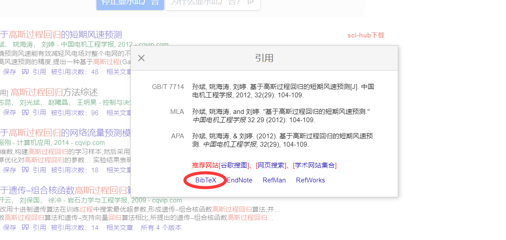

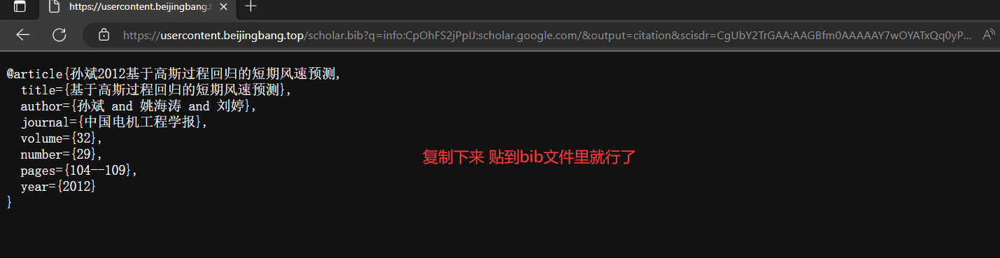

- [IEEEtran官方地址](https://www.bibtex.com/s/bibliography-style-ieeetran-ieeetran/#download)

- [bibtex文档](http://www.bibtex.org/Format/)

- [提取IEEEtran引用](https://www.citethisforme.com/citation-generator/ieee)

- TexStudio中文本的快速检索和替换

  - 快捷键 **ctrl+F**打开查找搜索框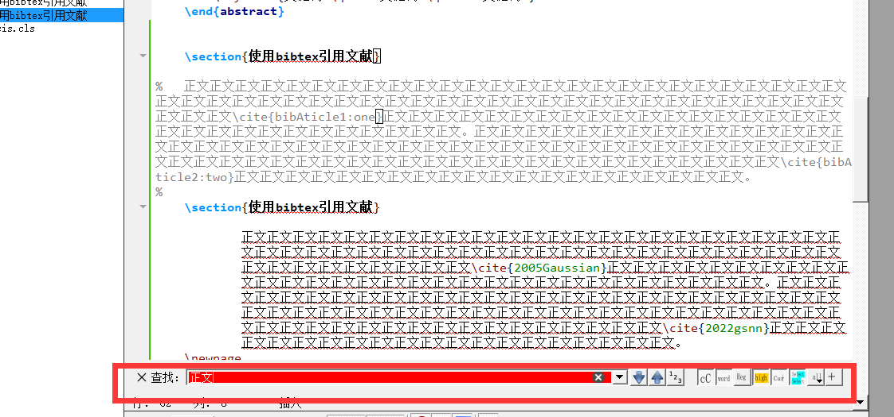

  - 快捷 **ctrl+R**打开替换搜索框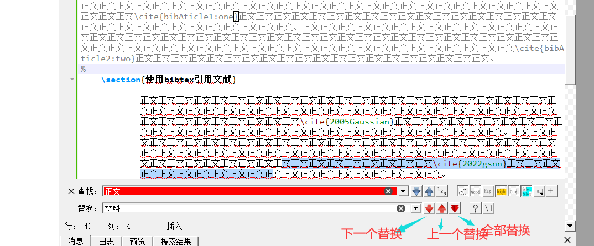

    

    