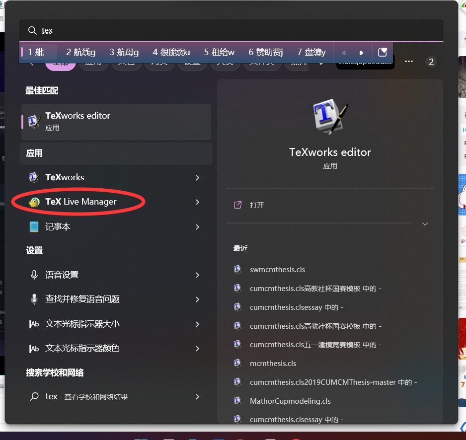
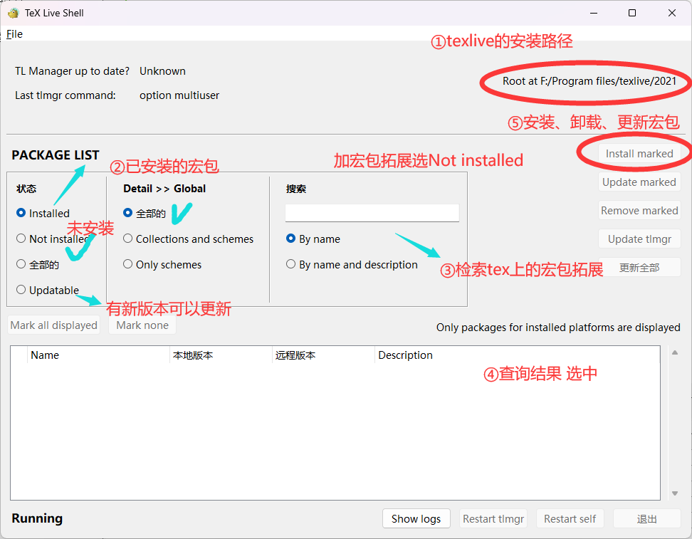
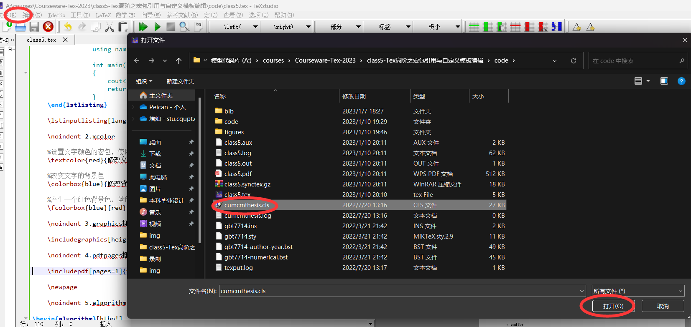

# Tex高阶之宏包引用与自定义模板编辑

## Tex中宏包、样式模板引用

- 引入宏包

  ```tex
  \usepackage[参数]{宏包包名}
  ```

- 引入样式

  - 论文主体样式模板(cls样式文件)

    ```tex
    \documentclass[参数]{cls样式文件名}
    ```

  - 引用格式样式(bst文件)

    ```tex
    \bibliographystyle{bst样式文件名}
    ```

- 宏包管理

  - Texlive Manager

    - 直接开始菜单搜索Texlive Manager 或者通过Texlive安装目录可以找到

    - 打开Texlive Manager

    - 搜索相应的宏包,选中下载、更新、卸载

      


## Tex中常用、好用的宏包

- **1.listings**
	- 设置代码框样式
	
	  ```tex
	  	\lstset{
	  		columns=fixed,       
	  		numbers=left,                                        % 在左侧显示行号
	  		numberstyle=\tiny\color{gray},                       % 设定行号格式
	  		frame=none,                                          % 不显示背景边框
	  		backgroundcolor=\color[RGB]{245,245,244},            % 设定背景颜色
	  		keywordstyle=\color[RGB]{40,40,255},                 % 设定关键字颜色
	  		numberstyle=\footnotesize\color{darkgray},           
	  		commentstyle=\it\color[RGB]{0,96,96},                % 设置代码注释的格式
	  		stringstyle=\rmfamily\slshape\color[RGB]{128,0,0},   % 设置字符串格式
	  		showstringspaces=false,                              % 不显示字符串中的空格
	  		language=c++,                                        % 设置语言
	  	}
	  	
	  ```
	
	  
	
	- 插入代码框
	
	  - 直接插入
	
	    ```tex
	    \begin{lstlisting}[title=code1,frame=shadowbox]
	    				#include <iostream>
	    				using namespace std;
	    				
	    				int main()
	    				{
	    					cout<<"hello"<<endl;
	    					return 0;
	    				}
	    	\end{lstlisting}
	    ```
	
	  - 插入文件
	
	    ```
	    \lstinputlisting[language=c++]{code/codetest.cpp}
	    ```
	
- **2.xcolor**

  - ```tex
    	%设置文字颜色的宏包，使用自定义和预定义的颜色
    	\textcolor{red}{修改文字颜色为红色}
    	
    	%改变文字的背景色
    	\colorbox{blue}{修改背景颜色为蓝色}
    	
    	%产生一个红色背景色，蓝色边框的效果
    	\fcolorbox{blue}{red}{文字加上蓝色边框、红色背景}
    ```

- **3.graphics插入图片**

  ```tex
  \includegraphics[height=2cm]{figures/sample.png}
  ```

- **4.pdfpages插入pdf 可以指定页码**

  ```tex
  \includepdf[pages=1]{figures/cat.pdf}
  ```

- **5.algorithm|algorithmic 编写伪代码**

  - 规则

    - \STATE 陈述条件 程序向下运行
    - \IF 判断语句
    - \ENDIF 分支语句
    - \FOR \ENDFOR for循环 
    - \WHILE while循环

  - ```tex
    \begin{algorithm}[htbp!]
    	\caption{PARTITION$(A,p,r)$}%算法标题
    	\begin{algorithmic}[1]%一行一个标行号
    		\STATE $i=p$
    		\FOR{$j=p$ to $r$}
    		\IF{$A[j]<=0$}
    		\STATE $swap(A[i],A[j])$
    		\STATE $i=i+1$
    		\ENDIF
    		\ENDFOR
    	\end{algorithmic}
    \end{algorithm}
    ```

- **6.amsmath|amssymb|amsfonts 特殊符号 **

- **7.ulem 下划线格式拓展**

  ```tex
  	This is \emph{emph}. %强调
  	
  	This is \uline{uline} %单下划线
  	
  	This is \uuline{uuline} %双下划线
  	
  	This is \uwave{uwave} %波浪线
  	
  	This is \sout{sout} %正中删除线
  	
  	This is \dotuline{dotuline} %点线
  	
  	This is \dashuline{dashuline} %虚线
  	
  	This is \xout{xout}\par %斜删除线
  ```

- **8.mathrsfs 花体字母**

  ```tex
  	$\mathbb{D}$
  	
  	$\mathcal{X}$
  	
  	$\mathscr{L}$
  ```

- **9.amsopn 自定义符号函数**

  ```tex
  		\usepackage{amsopn} %自定义预置符号函数
  		\DeclareMathOperator{\符号函数名}{替换规则} 
  		$\符号函数名$
  ```

  


## 读懂样式cls模板尝试修改

- 用TexStudio打开TexStudio

  

- 常用命令

  - 预置引入宏包

    ```tex
    \RequirePackage{宏包包名} %相当于正文\usepackage{宏包包名}的作用
    ```

  - 宏定义颜色

    ```tex
    \definecolor{颜色别名}{色域值}{r,g,b}
    \definecolor{dkgreen}{rgb}{0,0.6,0} %RGB大写范围在0-1
    \definecolor{dkgreen}{RGB}{0,180,0} %RGB大写范围在0-255
    \definecolor{dkgreen}{cymk}{0,1,0} %RGB大写范围在0-1 但是是色彩三原色 品青黄
    %使用宏颜色修改字体颜色
    \textcolor{颜色别名}{待修改颜色文本}
    \textcolor{dkgreen}{文字会百年城深绿色}
    ```

  - cls文件中可以写预设命令

    - 如可以写入listings的样式

      ```tex
       \lstset{
       	language=TeX,
       	backgroundcolor=\color{backcolour},   
       	commentstyle=\color{codegreen},
       	keywordstyle=\color{magenta},
       	numberstyle=\tiny\color{codegray},
       	stringstyle=\color{codepurple},
       	basicstyle=\small\yaheiconsola,
       	breakatwhitespace=false,         
       	breaklines=true,                 
       	captionpos=b,                    
       	keepspaces=true,                 
       	numbers=left,                    
       	numbersep=10pt,                  
       	showspaces=false,                
       	showstringspaces=false,
       	showtabs=false, 
       	%escapebegin=\begin{CJK*}{GBK}{hei},escapeend=\end{CJK*},
       	tabsize=4
       }
      ```

  - 列表环境设置

    - ```
      \setlist{%
      	topsep=0.3em, % 列表顶端的垂直空白
      	partopsep=0pt, % 列表环境前面紧接着一个空白行时其顶端的额外垂直空白
      	itemsep=0ex plus 0.1ex, % 列表项之间的额外垂直空白
      	parsep=0pt, % 列表项内的段落之间的垂直空白
      	leftmargin=1.5em, % 环境的左边界和列表之间的水平距离
      	rightmargin=0em, % 环境的右边界和列表之间的水平距离
      	labelsep=0.5em, % 包含标签的盒子与列表项的第一行文本之间的间隔
      	labelwidth=2em % 包含标签的盒子的正常宽度；若实际宽度更宽，则使用实际宽度。
      }
      
      ```

  - 用\renewcommand自定义命令封装函数

    ```tex
    \renewcommand{\maketitle}{\par
    	\begingroup
          \newpage
          \global\@topnum\z@   % Prevents figures from going at top of page.
          \@maketitle
        \endgroup
      \global\let\thanks\relax
      \global\let\maketitle\relax
      \global\let\@maketitle\relax
      \global\let\@thanks\@empty
      \global\let\@author\@empty
      \global\let\@date\@empty
      \global\let\@title\@empty
      \global\let\title\relax
      \global\let\author\relax
      \global\let\date\relax
      \global\let\and\relax
    }
    ```

    

## Where to 找宏包、模板		

## 论文模板在哪找呢

- [latexstudio](https://www.latexstudio.net/)
- [zhanwen](https://github.com/zhanwen/MathModel)

- [数模网论坛](https://www.shumo.com/forum/)

- [数学中国论坛](http://www.madio.net/)
- [CSDN搜索](https://so.csdn.net/)