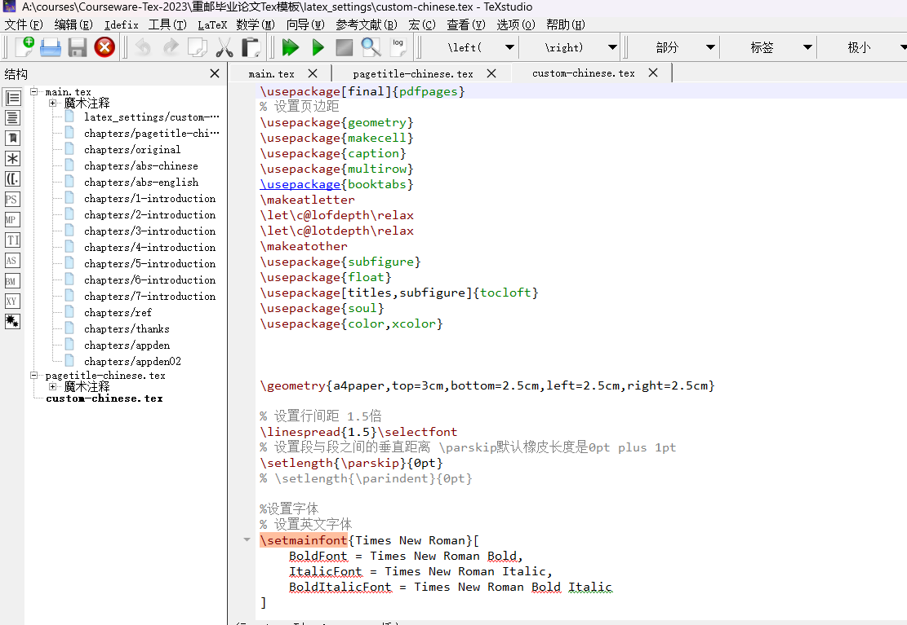

# 数学建模中Tex模板的运用

## CUMCM-thesis-2019

- 原始的模板最好进行优化的地方
  - 1.文献引用添加bibtex进行文献管理
  - 2.文献引用样式需要调整为GB/T2005格式
  - 3.代码框这个样式不好看,还没有序号,插入代码最好不要用tcode这个环境经常报错,修改为listings
  - 4.原始模板的表格、图片的序号是正文大小,应该减小半号字体
  - 5.在原始模板的基础上,进行调整,该一个包括数模论文基本结构的实战模板。
- 脚注的使用在期刊常用,数模论文可以添加脚注,但不推荐这么做。

## APMCM-thesis-2019

- 代码框同样没有序号,插入代码最好不要用tcode这个环境经常报错,修改为listings
- 文献引用样式需要调整为IEEE格式
- 目录中的三级标题过多,正式用这个模板的时候目录会溢出,标题中不要用斜体
- 调整为正式打比赛的样式,引入bibtex之类的,打比赛即拿即用。

## Mathorcup

- bibtex
- 文献引用样式用国标
- 没有pdf的宏包
- 图片、表格字号

## MCM-thesis

- bibtex
- IEEEtran
- listing的样式可以改成国赛模板的样式
- 缺一个目录

## 毕业论文模板

-  长篇论文、书籍模板会按照模块分出章节 ,切换章节在左侧的导航栏选中对应的章节页进行书写。

  

### **使用论文模板一定要做好工程管理 , 在一篇完整tex论文中,会用到大量的图片,支撑材料中的代码一定要按照文件夹分门别类放好,给图片重命名编号序号,方便检查**